# Домашнее задание к занятию «Использование Terraform в команде» - `Некрасов Александр`

---
### Цели задания

1. Научиться использовать remote state с блокировками.
2. Освоить приёмы командной работы.


### Чек-лист готовности к домашнему заданию

1. Зарегистрирован аккаунт в Yandex Cloud. Использован промокод на грант.
2. Установлен инструмент Yandex CLI.
3. Любые ВМ, использованные при выполнении задания, должны быть прерываемыми, для экономии средств.

------
### Внимание!! Обязательно предоставляем на проверку получившийся код в виде ссылки на ваш github-репозиторий!
Убедитесь что ваша версия **Terraform** ~>1.12.0
Пишем красивый код, хардкод значения не допустимы!

------
### Задание 0
1. Прочтите статью: https://neprivet.com/
2. Пожалуйста, распространите данную идею в своем коллективе.

------

### Задание 1

1. Возьмите код:
- из [ДЗ к лекции 4](https://github.com/netology-code/ter-homeworks/tree/main/04/src),
- из [демо к лекции 4](https://github.com/netology-code/ter-homeworks/tree/main/04/demonstration1).
2. Проверьте код с помощью tflint и checkov. Вам не нужно инициализировать этот проект.
3. Перечислите, какие **типы** ошибок обнаружены в проекте (без дублей).

------

### Задание 2

1. Возьмите ваш GitHub-репозиторий с **выполненным ДЗ 4** в ветке 'terraform-04' и сделайте из него ветку 'terraform-05'.
2. Настройте remote state с встроенными блокировками:
   - Создайте S3 bucket в Yandex Cloud для хранения state (если еще не создан)
   - Создайте service account с правами на чтение/запись в bucket
   - Настройте backend в providers.tf с использованием нового механизма блокировок:
     ```hcl
     terraform {
       required_version = "~>1.12.0"
       
       backend "s3" {
         bucket  = "ваш-bucket-name"
         key     = "terraform.tfstate"
         region  = "ru-central1"
         
         # Встроенный механизм блокировок (Terraform >= 1.6)
         # Не требует отдельной базы данных!
         use_lockfile = true
         
         endpoints = {
           s3 = "https://storage.yandexcloud.net"
         }
         
         skip_region_validation      = true
         skip_credentials_validation = true
         skip_requesting_account_id  = true
         skip_s3_checksum            = true
       }
     }
     ```
   - Выполните `terraform init -migrate-state` для миграции state в S3
   - Предоставьте скриншоты процесса настройки и миграции
3. Закоммитьте в ветку 'terraform-05' все изменения.
4. Откройте в проекте terraform console, а в другом окне из этой же директории попробуйте запустить terraform apply.
5. Пришлите ответ об ошибке доступа к state (блокировка должна сработать автоматически).
6. Принудительно разблокируйте state командой `terraform force-unlock <LOCK_ID>`. Пришлите команду и вывод.

**Примечание:** В Terraform >= 1.6 появился встроенный механизм блокировок через `use_lockfile = true`. 
Это упрощает настройку - больше не нужно создавать отдельную базу данных (YDB в режиме DynamoDB) для хранения блокировок.
Lock-файл создается автоматически в том же S3 bucket рядом с state-файлом с именем `<key>.lock.info`.


------
### Задание 3  

1. Сделайте в GitHub из ветки 'terraform-05' новую ветку 'terraform-hotfix'.
2. Проверье код с помощью tflint и checkov, исправьте все предупреждения и ошибки в 'terraform-hotfix', сделайте коммит.
3. Откройте новый pull request 'terraform-hotfix' --> 'terraform-05'. 
4. Вставьте в комментарий PR результат анализа tflint и checkov, план изменений инфраструктуры из вывода команды terraform plan.
5. Пришлите ссылку на PR для ревью. Вливать код в 'terraform-05' не нужно.

------
### Задание 4

1. Напишите переменные с валидацией и протестируйте их, заполнив default верными и неверными значениями. Предоставьте скриншоты проверок из terraform console. 

- type=string, description="ip-адрес" — проверка, что значение переменной содержит верный IP-адрес с помощью функций cidrhost() или regex(). Тесты:  "192.168.0.1" и "1920.1680.0.1";
- type=list(string), description="список ip-адресов" — проверка, что все адреса верны. Тесты:  ["192.168.0.1", "1.1.1.1", "127.0.0.1"] и ["192.168.0.1", "1.1.1.1", "1270.0.0.1"].

## Дополнительные задания (со звёздочкой*)

**Настоятельно рекомендуем выполнять все задания со звёздочкой.** Их выполнение поможет глубже разобраться в материале.   
Задания со звёздочкой дополнительные, не обязательные к выполнению и никак не повлияют на получение вами зачёта по этому домашнему заданию. 
------
### Задание 5*
1. Напишите переменные с валидацией:
- type=string, description="любая строка" — проверка, что строка не содержит символов верхнего регистра;
- type=object — проверка, что одно из значений равно true, а второе false, т. е. не допускается false false и true true:
```
variable "in_the_end_there_can_be_only_one" {
    description="Who is better Connor or Duncan?"
    type = object({
        Dunkan = optional(bool)
        Connor = optional(bool)
    })

    default = {
        Dunkan = true
        Connor = false
    }

    validation {
        error_message = "There can be only one MacLeod"
        condition = <проверка>
    }
}
```
------
### Задание 6*

1. Настройте любую известную вам CI/CD-систему. Если вы ещё не знакомы с CI/CD-системами, настоятельно рекомендуем вернуться к этому заданию после изучения Jenkins/Teamcity/Gitlab.
2. Скачайте с её помощью ваш репозиторий с кодом и инициализируйте инфраструктуру.
3. Уничтожьте инфраструктуру тем же способом.


------
### Задание 7*
1. Настройте отдельный terraform root модуль, который будет создавать инфраструктуру для remote state:
   - S3 bucket для tfstate с версионированием
   - Сервисный аккаунт с необходимыми правами (storage.editor)
   - Static access key для сервисного аккаунта
2. Output должен содержать:
   - Имя bucket
   - Access key ID и Secret key (sensitive)
   - Пример конфигурации backend для использования
3. После создания инфраструктуры используйте outputs для настройки backend в основном проекте.

**Примечание:** Так как используется `use_lockfile = true`, создавать YDB/DynamoDB больше не требуется.
Блокировки реализованы встроенным механизмом Terraform и хранятся в том же S3 bucket. 

### Правила приёма работы

Ответы на задания и необходимые скриншоты оформите в md-файле в ветке terraform-05.

В качестве результата прикрепите ссылку на ветку terraform-05 в вашем репозитории.

---

### Решение 1. Анализ кода с tflint и checkov.

_Установка tflint._
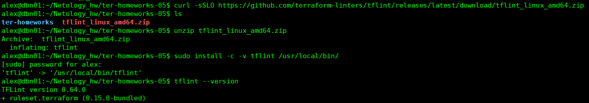
_Установка checkov._
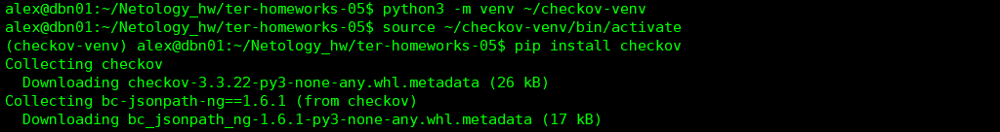
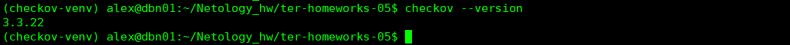
_Результаты tflint._
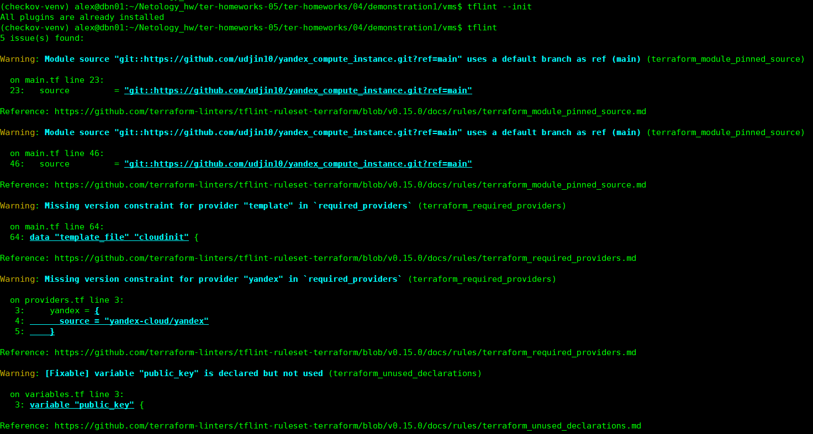
_Результаты checkov._
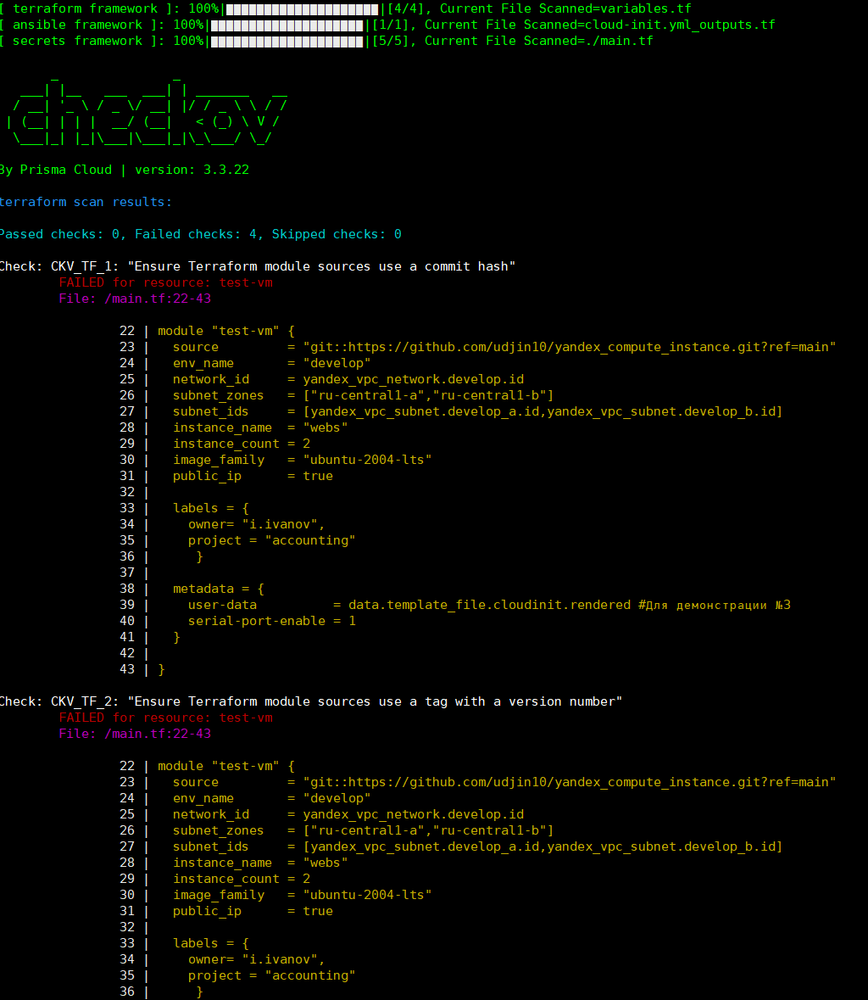

Уникальные типы ошибок
- tflint: 

1. terraform_module_pinned_source. Модуль использует default branch (main) вместо конкретного тега/хеша.
2. terraform_required_providers. Отсутствует version constraint для провайдера в required_providers.
3. terraform_unused_declarations. Переменная/local объявлена, но не используется.
4. terraform_required_version. Отсутствует атрибут required_version в блоке terraform.
5. terraform_deprecated_index. List items accessed using deprecated syntax (self.network_interface.0 вместо [0]).

- checkov: 

1. CKV_TF_1. Ensure Terraform module sources use a commit hash.
2. CKV_TF_2. Ensure Terraform module sources use a tag with a version number.
3. CKV_YC_2. Ensure compute instance does not have public IP.
4. CKV_YC_4. Ensure compute instance does not have serial console enabled.
5. CKV_YC_11. Ensure security group is assigned to network interface.
6. CKV_SECRET_6. Base64 High Entropy String (был SKIPPED — заглушен комментарием #education).

_Дополнительные скриншоты по ошибкам находятся в директории /img (не стал включать в README.md, чтобы не перегружать отчет по ДЗ):_
* img/Screenshot_6.png
* img/Screenshot_7.png
* img/Screenshot_8.png
* img/Screenshot_9.png
* img/Screenshot_10.png
* img/Screenshot_11.png
* img/Screenshot_12.png
* img/Screenshot_13.png
---
### Решение 2. Remote state с S3 backend.
_Создание сервисного аккаунта для terraform-state._
```
yc iam service-account create --name terraform-state-sa --folder-id b1g6rtd8d4un95vmpsql
```
_Выдача прав._

```
yc resource-manager folder add-access-binding b1g6rtd8d4un95vmpsql \
  --role storage.admin \
  --service-account-name terraform-state-sa
```
_Создание статического ключа доступа._

```
yc iam access-key create --service-account-name terraform-state-sa
```
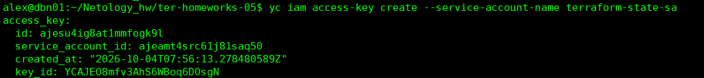

_Создание bucket._
```
yc storage bucket create --name alex-terraform-state-2026 --folder-id b1g6rtd8d4un95vmpsql
```
_Проверка bucket._
```
yc storage bucket list
```
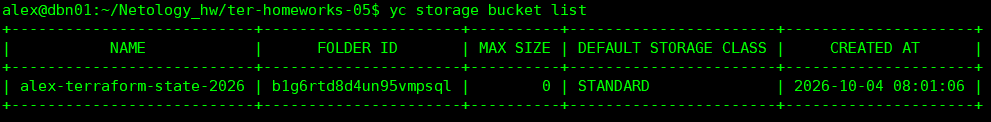

_Миграция state._
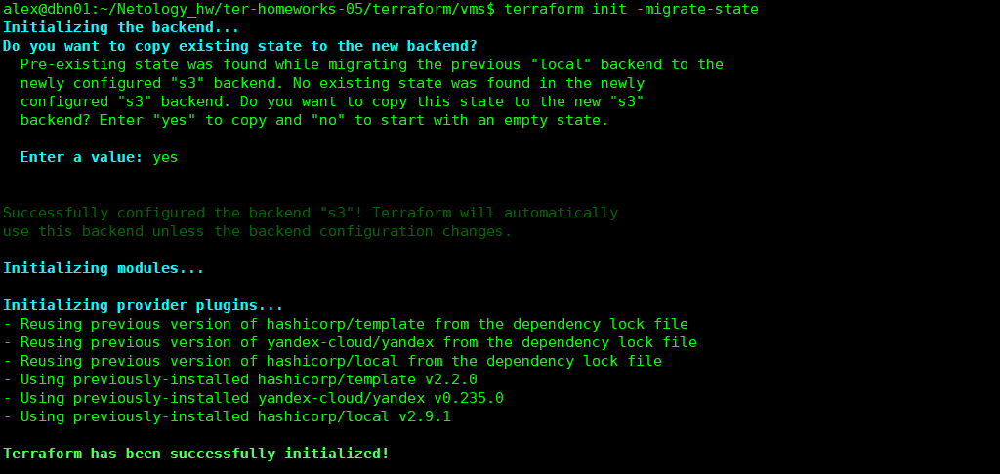

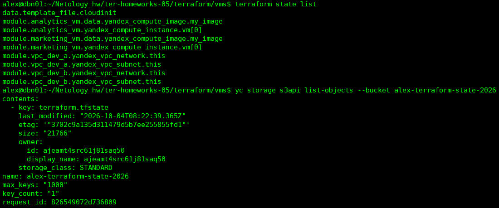

_Блокировка state. 2 терминала (в верхнем открыта консоль терраформ, в нижнем ошибка о блокировке)._
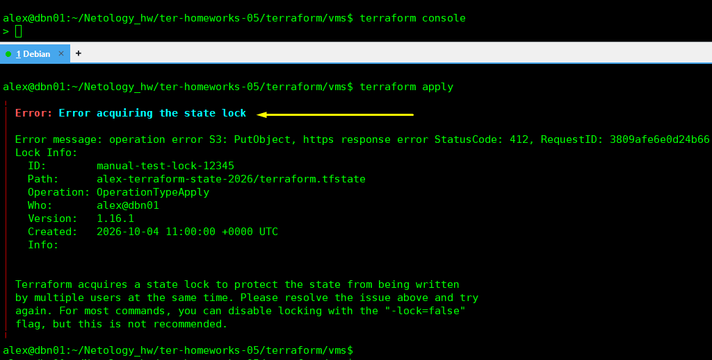

_Разблокировка Force-unlock._
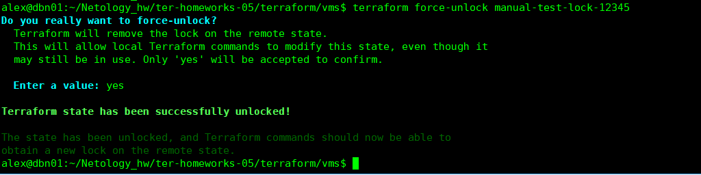

### Решение 3: PR с исправлениями.
Ссылка: https://github.com/AlexandrNekrasov/ter-homeworks-05/pull/1

_Результаты проверок:_
- tflint: 0 issues
- checkov: 0 failed
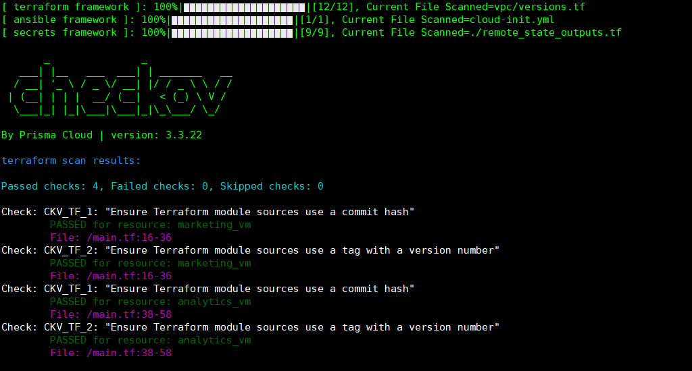
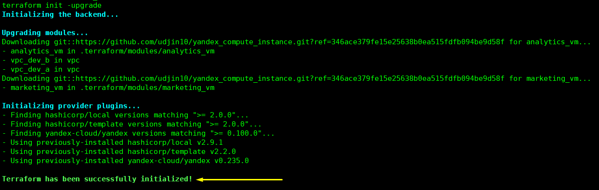


### Решение 4: Валидация переменных.

Содержимое файла variables_validation.tf

```
alex@dbn01:~/Netology_hw/ter-homeworks-05/terraform/vms$ cat variables_validation.tf
variable "ip_address" {
  type        = string
  description = "ip-адрес"
  default     = "192.168.0.1"

  validation {
    condition     = can(cidrhost("${var.ip_address}/32", 0))
    error_message = "Значение должно быть корректным IP-адресом (IPv4)."
  }
}

variable "ip_list" {
  type        = list(string)
  description = "список ip-адресов"
  default     = ["192.168.0.1", "1.1.1.1", "127.0.0.1"]

  validation {
    condition     = alltrue([for ip in var.ip_list : can(cidrhost("${ip}/32", 0))])
    error_message = "Все значения в списке должны быть корректными IP-адресами (IPv4)."
  }
}

```
_No changes — валидация прошла._
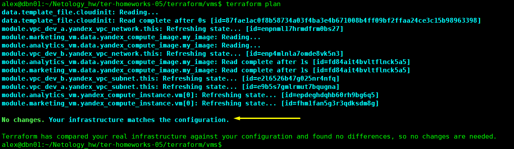

_Неверный IP-адрес._
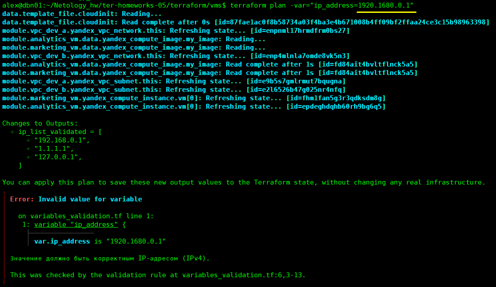

_Верный список, без ошибок._
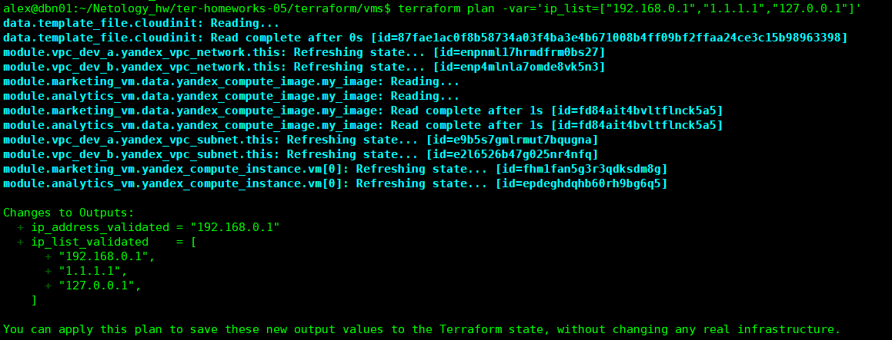

_Неверный список, с ошибкой._
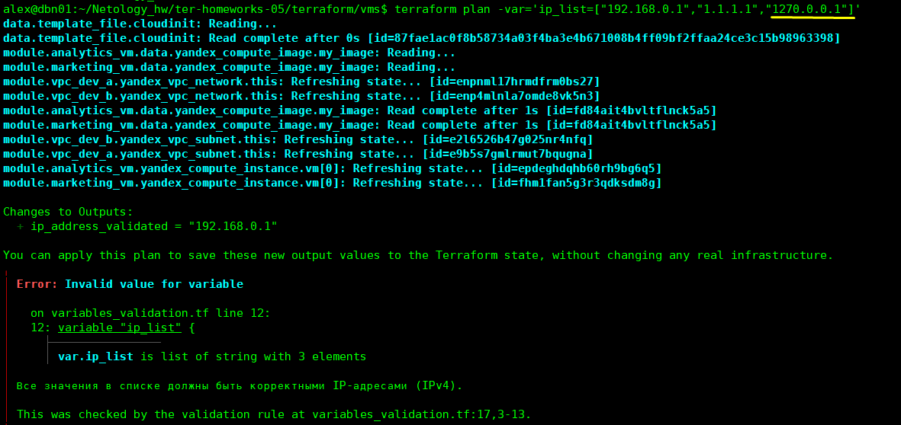
